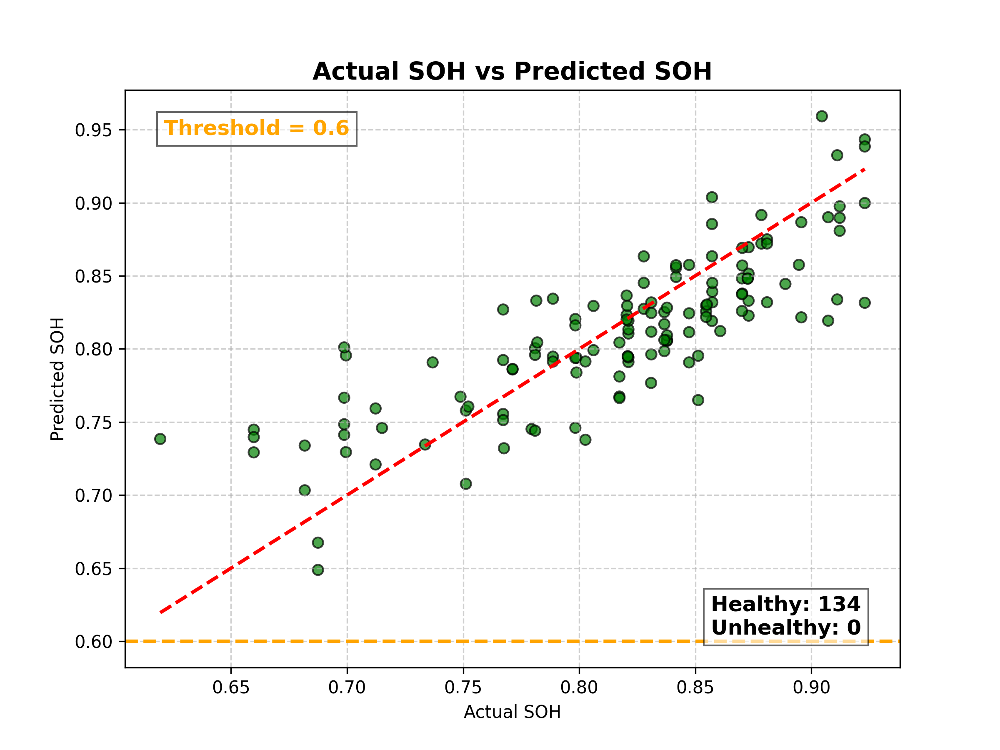
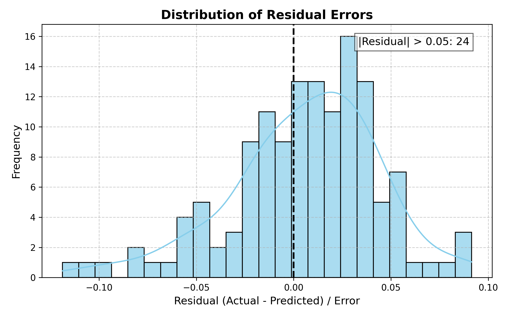

# SOFE 3370 Final Project: Part 1 - Battery Pack SOH Prediction using Linear Regression

This project predicts the **State of Health (SOH)** of battery cells using a Linear Regression model trained on voltage readings (U1–U21). It also classifies batteries as **Healthy** or **Unhealthy** based on a user-defined SOH threshold.

---

## Project Structure

```
Battery Pack SOH Prediction/
│
├── Data/
│   ├── PulseBat Dataset.xlsx              # Raw dataset provided (input file)
│   ├── Cleaned_PulseBat_Dataset.xlsx      # Auto-generated cleaned dataset
│
├── results/                               # Output plots are saved here 
│   ├── Actual_vs_Predicted_SOH.png         
│   ├── Residuals_Distribution.png
│
├── Linear_Regression.py                   # Main Python script
└── README.md                              
```

**Note:** The results folder will be automatically created when the code runs if it doesn’t already exist in the directory.

---

## Tech & Tools Used

- **Pandas:** Used for Data Manipulation and Cleaning
- **numpy:** Used for Numerical Operations and Array Manipulation
- **scikit-learn:** A machine learning library used for model building and evaluation
- **matplotlib:** A Data Visualization library used for Static Plotting
- **seaborn:** A statistical visualization library used to build graphs/plots

---

## Requirements

**Make sure you have the following Python libraries installed:**

```bash
pip install pandas numpy scikit-learn matplotlib seaborn openpyxl
```
**Ensure File Placement**

Place `PulseBat Dataset.xlsx` inside the `Data/` folder (the script expects this path).

**Visual Studio Code Extensions**

If you are using Visual Studio Code, ensure to install the Python Extension by Microsoft

---

## How to Run the Program

1. **Run the script:**
   ```bash
   python Linear_Regression.py
   ```
   (or click the run button on your IDE)

3. **During execution, you will be prompted:**
   ```
   Enter SOH threshold for classification (e.g., 0.6):
   ```
   - Press **Enter** to use the default value (0.6), or type your own.  
   - Example input:
     ```
     0.8
     ```

4. **Outputs Generated:**
   - Console output with evaluation metrics (R², MSE, MAE) for unsorted, ascending, and descending datasets.
   - Two plots automatically saved in the `results/` folder:
     - `Actual_vs_Predicted_SOH.png` — visualizes actual vs predicted SOH values.
     - `Residuals_Distribution.png` — shows the distribution of prediction errors.

5. **Output preview (with SOH Threshold of 0.6):**
   ```
    📊 Unsorted Data Model Evaluation Metrics:
    R² Score: 0.6561
    Mean Squared Error (MSE): 0.0015
    Mean Absolute Error (MAE): 0.0303

    📊 Ascending Data Model Evaluation Metrics:
    R² Score: 0.6588
    Mean Squared Error (MSE): 0.0015
    Mean Absolute Error (MAE): 0.0304

    📊 Descending Data Model Evaluation Metrics:
    R² Score: 0.6588
    Mean Squared Error (MSE): 0.0015
    Mean Absolute Error (MAE): 0.0304

    ⏱️ Total script execution time: 0.2679 seconds

    🔋 Sample predictions with classification:
        Actual SOH  Predicted SOH Actual Class Predicted Class
    1     0.779476       0.745177      Healthy         Healthy
    2     0.872952       0.869526      Healthy         Healthy
    3     0.767238       0.826942      Healthy         Healthy
    4     0.830952       0.776730      Healthy         Healthy
    5     0.878476       0.872055      Healthy         Healthy
    6     0.733619       0.734584      Healthy         Healthy
    7     0.821190       0.810496      Healthy         Healthy
    8     0.698762       0.766622      Healthy         Healthy
    9     0.817333       0.804345      Healthy         Healthy
    10    0.904524       0.959155      Healthy         Healthy    
    ```
### Actual vs Predicted SOH


### Residuals Distribution


---

## Features of the Code

- **Dataset Handling:** Removes missing values and keeps only U1–U21 and SOH columns.
- **Sorting 3 Orders:** Tests 3 dataset versions (Unsorted, Ascending, Descending).
- **Linear Regression Modeling:** Trains a Linear Regression model using scikit-learn.
- **Linear Regression Evaluation:** Computes R² Score, MSE, MAE for each data variant.
- **Battery Classification:** Uses SOH threshold to label batteries as *Healthy* or *Unhealthy*.
- **Plotting & Visualization:** Saves scatter and residual plots under the `results/` directory.

---

**Author:** Prabhnoor Saini, Khushi Patel, Vinujen Dilogen, Rukshan Baskaran  
**Project:** SOFE 3370 Battery Pack SOH Prediction using Linear Regression & Chatbot Integration
